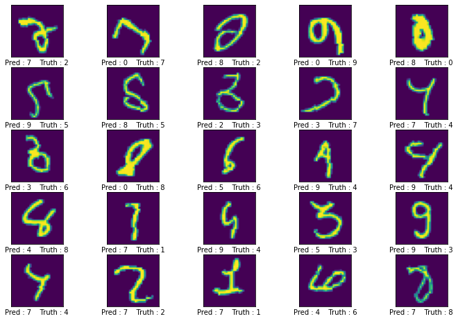
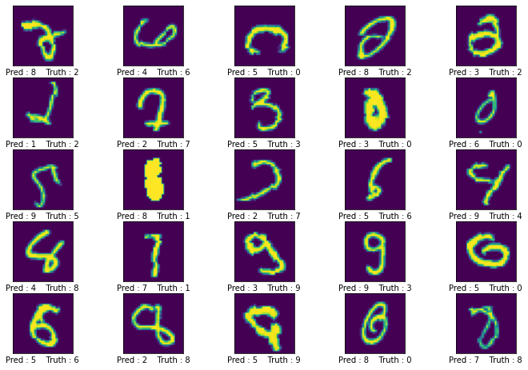
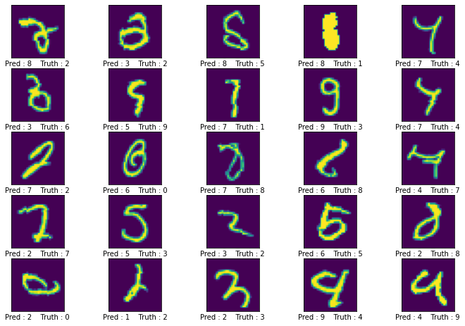
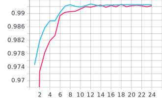
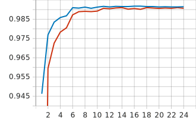
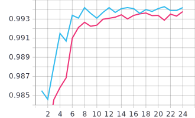
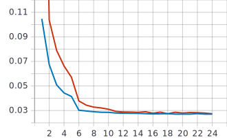
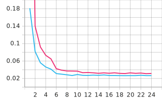
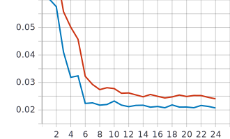

# Session6
## Contents
[1.Normalization Module](#norm_module)  
[1.Normalization Technique Working](#norm_excel)  
[2.Network with Group Normalization + L1](#EVAS6_iter_1)  
[3.Network with Layer Normalization + L2](#EVAS6_iter_2)  
[4.Network with L1 + L2 + BN](#EVAS6_iter_3)  
[4.Loss ](#EVAS6_iter_3)  

**1. Normalization Module:**<a name="norm_module"></a>
Layer Normalization is a special case of Group Normalization. Where Layer Normalization has Group as 1.
```python
def normalization_technique(normalization,in_channels):
    if normalization == "GN":
        return nn.GroupNorm(2,in_channels)
    elif normalization == "LN":
        return nn.GroupNorm(1,in_channels)
    else:
        return nn.BatchNorm2d(in_channels)
```

**2. Normalization Technique Working:**<a name="norm_excel"></a>
Excel shown [here](Batch_layer_group_norm.ods) shows how to perform the three Normalization techniques.
**2. Network with Group Normalization + L1:**<a name="EVAS6_iter_1"></a>
[EVAS6_iter_1](EVAS6_iter_1.ipynb)
Click [here](https://tensorboard.dev/experiment/w5w8rj1SR9mirUxefAxiEA/) for visualization of tensorboard.
  
**25** misclassified images


**3. Network with Layer Normalization + L2:**<a name="EVAS6_iter_2"></a>
[EVAS6_iter_2](EVAS6_iter_2.ipynb)
Click [here](https://tensorboard.dev/experiment/kPv1c9zrRcaoKAEoyBLmPw/) for visualization of tensorboard.

**25** misclassified images


**4. Network with L1 + L2 + BN:**<a name="EVAS6_iter_3"></a>
[EVAS6_iter_3](EVAS6_iter_3.ipynb)
Click [here](https://tensorboard.dev/experiment/3e9S68TNSYuwfwmSL5iyXw/) for visualization of tensorboard.

**25** misclassified images



<p float="left">
  
   
  
</p>

<p float="left">
  
   
  
</p>


