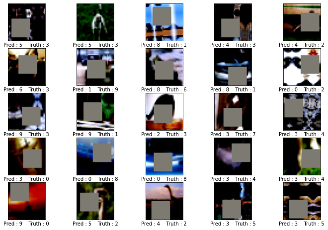

# Session7
## Contents
[1. Model Code](#model_code)  
[2. Model Summary](#model_summary)  
[3. Albumentation Transforms](#alb_transforms)  
[4. Training Log](#training_log)  
[5. Final Notebook](#final_notebook)  
[6. Misclassified Images](#mis_images)  
[7. Tensorboard URL](#tensor_url)  


**1. Model Code:**<a name="model_code"></a>  
```python
def base_block(in_channel_size,out_channels,norm_type = "BN",dropout_value = 0.01):
    if type(out_channels) == list and len(out_channels) == 4:
        out_channel_info = out_channels
    elif type(out_channels) == int:
        out_channel_info = [out_channels] * 4
    else:
        raise(TypeError,"out_channels should be a list of len 4 or a int")
    return nn.Sequential(
        nn.Conv2d(in_channels=in_channel_size, out_channels=out_channel_info[0], kernel_size=3,padding=1),
        nn.ReLU(),
        normalization_technique(norm_type,out_channel_info[0]),
        nn.Dropout(dropout_value),

        nn.Conv2d(in_channels=out_channel_info[0], out_channels=in_channel_size, kernel_size=3,padding=1, dilation = 1),
        nn.ReLU(),
        normalization_technique(norm_type,in_channel_size),
        nn.Dropout(dropout_value),
        
        # nn.Conv2d(in_channels=in_channel_size, out_channels=out_channel_info[0], kernel_size=3,padding=1),
        # nn.ReLU(),
        # normalization_technique(norm_type,out_channel_info[0]),
        # nn.Dropout(dropout_value),

        # nn.Conv2d(in_channels=out_channel_info[0], out_channels=out_channel_info[0], kernel_size=1),
        # nn.ReLU(),
        # normalization_technique(norm_type,out_channel_info[0]),
        # nn.Dropout(dropout_value)
        nn.Conv2d(
            in_channels=in_channel_size,
            out_channels=in_channel_size,
            kernel_size=3,
            stride=1,
            padding=1,
            groups=in_channel_size
        ),
        nn.ReLU(),
        normalization_technique(norm_type,in_channel_size),
        nn.Dropout(dropout_value),
        nn.Conv2d(
            in_channels=in_channel_size,
            out_channels=out_channel_info[0],
            kernel_size=1,
            stride=1,
            padding=0,
            groups=1
        ),
        nn.ReLU(),
        normalization_technique(norm_type,out_channel_info[0]),
        nn.Dropout(dropout_value)

    )

def normalization_technique(normalization,in_channels):
    if type(normalization) not in [int,list] and type(in_channels) != int:
        raise(TypeError,f"normalization should be a int or list,in_channels should be int")

    if normalization == "GN":
        return nn.GroupNorm(2,in_channels)
    elif normalization == "LN":
        return nn.GroupNorm(1,in_channels)
    elif normalization == "BN":
        return nn.BatchNorm2d(in_channels)
    else:
        raise(ValueError,"normalization should be GN or LN or BN")

class Net(nn.Module):
    def __init__(self ,norm_type : "BN/LN/GN"):
        super(Net, self).__init__()
        self.convblock1 = base_block(3,36)
        # self.maxpool1 = nn.MaxPool2d(2, 2)
        self.convblock2 = base_block(36,36)
        self.maxpool2 = nn.Sequential(nn.Conv2d(in_channels=36, out_channels=36, 
                                  kernel_size=3, dilation = 2,stride = 2),
                                    nn.ReLU(),
                                    normalization_technique("BN",36),
                                    nn.Dropout(0.01))
        self.convblock3 = base_block(36,60)
        # self.maxpool3 = nn.MaxPool2d(2, 2)
        self.convblock4 = base_block(60,65)
        self.maxpool4 = nn.Sequential(nn.Conv2d(in_channels=65, out_channels=70, 
                                  kernel_size=3, dilation = 2,stride = 2),
                                    nn.ReLU(),
                                    normalization_technique("BN",70),
                                    nn.Dropout(0.01))

        self.output_layer = nn.Conv2d(in_channels=70, out_channels=10, kernel_size=1)
        self.gap = nn.Sequential(
                nn.AdaptiveAvgPool2d(1)
            )
    def forward(self, x):
        x = self.convblock1(x)
        # x = self.maxpool1(x)

        x = self.convblock2(x)
        x = self.maxpool2(x)

        x = self.convblock3(x)
        # x = self.maxpool3(x)

        x = self.convblock4(x)
        x = self.maxpool4(x)

        x = self.output_layer(x)

        x = self.gap(x)
        x = x.view(-1, 10)
        return F.log_softmax(x, dim=-1)
```

**2. Model Summary:**<a name="model_summary"></a>  
```python
----------------------------------------------------------------
        Layer (type)               Output Shape         Param #
================================================================
            Conv2d-1           [-1, 36, 32, 32]           1,008
              ReLU-2           [-1, 36, 32, 32]               0
       BatchNorm2d-3           [-1, 36, 32, 32]              72
           Dropout-4           [-1, 36, 32, 32]               0
            Conv2d-5            [-1, 3, 32, 32]             975
              ReLU-6            [-1, 3, 32, 32]               0
       BatchNorm2d-7            [-1, 3, 32, 32]               6
           Dropout-8            [-1, 3, 32, 32]               0
            Conv2d-9            [-1, 3, 32, 32]              30
             ReLU-10            [-1, 3, 32, 32]               0
      BatchNorm2d-11            [-1, 3, 32, 32]               6
          Dropout-12            [-1, 3, 32, 32]               0
           Conv2d-13           [-1, 36, 32, 32]             144
             ReLU-14           [-1, 36, 32, 32]               0
      BatchNorm2d-15           [-1, 36, 32, 32]              72
          Dropout-16           [-1, 36, 32, 32]               0
           Conv2d-17           [-1, 36, 32, 32]          11,700
             ReLU-18           [-1, 36, 32, 32]               0
      BatchNorm2d-19           [-1, 36, 32, 32]              72
          Dropout-20           [-1, 36, 32, 32]               0
           Conv2d-21           [-1, 36, 32, 32]          11,700
             ReLU-22           [-1, 36, 32, 32]               0
      BatchNorm2d-23           [-1, 36, 32, 32]              72
          Dropout-24           [-1, 36, 32, 32]               0
           Conv2d-25           [-1, 36, 32, 32]             360
             ReLU-26           [-1, 36, 32, 32]               0
      BatchNorm2d-27           [-1, 36, 32, 32]              72
          Dropout-28           [-1, 36, 32, 32]               0
           Conv2d-29           [-1, 36, 32, 32]           1,332
             ReLU-30           [-1, 36, 32, 32]               0
      BatchNorm2d-31           [-1, 36, 32, 32]              72
          Dropout-32           [-1, 36, 32, 32]               0
           Conv2d-33           [-1, 36, 14, 14]          11,700
             ReLU-34           [-1, 36, 14, 14]               0
      BatchNorm2d-35           [-1, 36, 14, 14]              72
          Dropout-36           [-1, 36, 14, 14]               0
           Conv2d-37           [-1, 60, 14, 14]          19,500
             ReLU-38           [-1, 60, 14, 14]               0
      BatchNorm2d-39           [-1, 60, 14, 14]             120
          Dropout-40           [-1, 60, 14, 14]               0
           Conv2d-41           [-1, 36, 14, 14]          19,476
             ReLU-42           [-1, 36, 14, 14]               0
      BatchNorm2d-43           [-1, 36, 14, 14]              72
          Dropout-44           [-1, 36, 14, 14]               0
           Conv2d-45           [-1, 36, 14, 14]             360
             ReLU-46           [-1, 36, 14, 14]               0
      BatchNorm2d-47           [-1, 36, 14, 14]              72
          Dropout-48           [-1, 36, 14, 14]               0
           Conv2d-49           [-1, 60, 14, 14]           2,220
             ReLU-50           [-1, 60, 14, 14]               0
      BatchNorm2d-51           [-1, 60, 14, 14]             120
          Dropout-52           [-1, 60, 14, 14]               0
           Conv2d-53           [-1, 65, 14, 14]          35,165
             ReLU-54           [-1, 65, 14, 14]               0
      BatchNorm2d-55           [-1, 65, 14, 14]             130
          Dropout-56           [-1, 65, 14, 14]               0
           Conv2d-57           [-1, 60, 14, 14]          35,160
             ReLU-58           [-1, 60, 14, 14]               0
      BatchNorm2d-59           [-1, 60, 14, 14]             120
          Dropout-60           [-1, 60, 14, 14]               0
           Conv2d-61           [-1, 60, 14, 14]             600
             ReLU-62           [-1, 60, 14, 14]               0
      BatchNorm2d-63           [-1, 60, 14, 14]             120
          Dropout-64           [-1, 60, 14, 14]               0
           Conv2d-65           [-1, 65, 14, 14]           3,965
             ReLU-66           [-1, 65, 14, 14]               0
      BatchNorm2d-67           [-1, 65, 14, 14]             130
          Dropout-68           [-1, 65, 14, 14]               0
           Conv2d-69             [-1, 70, 5, 5]          41,020
             ReLU-70             [-1, 70, 5, 5]               0
      BatchNorm2d-71             [-1, 70, 5, 5]             140
          Dropout-72             [-1, 70, 5, 5]               0
           Conv2d-73             [-1, 10, 5, 5]             710
AdaptiveAvgPool2d-74             [-1, 10, 1, 1]               0
================================================================
Total params: 198,665
Trainable params: 198,665
Non-trainable params: 0
----------------------------------------------------------------
Input size (MB): 0.01
Forward/backward pass size (MB): 9.85
Params size (MB): 0.76
Estimated Total Size (MB): 10.62
----------------------------------------------------------------
```

**3. Albumentation Transforms:**<a name="alb_transforms"></a>  
```python
train_transforms_list = A.Compose(
    [
        A.Normalize(mean=[0.49139968,0.48215841,0.44653091], std=[0.49139968,0.48215841,0.44653091]),
        # A.Rotate(limit = (-7,7),always_apply = True),
        A.ShiftScaleRotate(shift_limit=0.0625, scale_limit=0.50, rotate_limit=(-7,7), p=.75),
        A.CoarseDropout (max_holes = 1, max_height=16, max_width=16, min_holes = 1, min_height=16, min_width=16, fill_value=[0.49139968,0.48215841,0.44653091],p = 0.75),
        # A.Cutout(num_holes=1, max_h_size=16, max_w_size=16, fill_value=[1,1,1], always_apply=True, p=0.5),
        A.HorizontalFlip(p=0.75),
        ToTensorV2()
    ]
)
```

**4. Training Log:**<a name="training_log"></a>  
```python
Train Epoch 1: 100%
196/196 [00:22<00:00, 8.61batch/s, accuracy=37.5000, loss=1.65]
/usr/local/lib/python3.7/dist-packages/torch/utils/data/dataloader.py:481: UserWarning: This DataLoader will create 8 worker processes in total. Our suggested max number of worker in current system is 4, which is smaller than what this DataLoader is going to create. Please be aware that excessive worker creation might get DataLoader running slow or even freeze, lower the worker number to avoid potential slowness/freeze if necessary.
  cpuset_checked))

Test Epoch 1: 100%
40/40 [02:04<00:00, 3.12s/batch, accuracy=56.2500, loss=1.3]

Train_epoch :  32.670000195503235
Test_epoch :  42.69999861717224
Learning Rate :  0.1
Train Epoch 2: 100%
196/196 [02:03<00:00, 1.59batch/s, accuracy=37.5000, loss=1.7]

Test Epoch 2: 100%
40/40 [01:40<00:00, 2.51s/batch, accuracy=43.7500, loss=2.1]

Train_epoch :  42.22999811172485
Test_epoch :  46.16999924182892
Learning Rate :  0.1
Train Epoch 3: 100%
196/196 [01:38<00:00, 1.99batch/s, accuracy=48.7500, loss=1.45]

Test Epoch 3: 100%
40/40 [01:15<00:00, 1.90s/batch, accuracy=62.5000, loss=1.11]

Train_epoch :  47.123998403549194
Test_epoch :  56.54999613761902
Learning Rate :  0.1
Train Epoch 4: 100%
196/196 [01:14<00:00, 2.64batch/s, accuracy=52.5000, loss=1.33]

Test Epoch 4: 100%
40/40 [00:51<00:00, 1.28s/batch, accuracy=62.5000, loss=0.989]

Train_epoch :  51.142001152038574
Test_epoch :  60.96999645233154
Learning Rate :  0.1
Train Epoch 5: 100%
196/196 [00:49<00:00, 3.96batch/s, accuracy=46.2500, loss=1.42]

Test Epoch 5: 100%
40/40 [00:26<00:00, 1.50batch/s, accuracy=75.0000, loss=1.1]

Train_epoch :  54.19999957084656
Test_epoch :  65.77000021934509
Learning Rate :  0.1
Train Epoch 6: 100%
196/196 [00:24<00:00, 7.85batch/s, accuracy=55.0000, loss=1.39]

Test Epoch 6: 100%
40/40 [00:02<00:00, 17.76batch/s, accuracy=56.2500, loss=1.14]

Train_epoch :  56.599998474121094
Test_epoch :  66.57999753952026
Learning Rate :  0.1
Train Epoch 7: 100%
196/196 [00:22<00:00, 8.59batch/s, accuracy=53.7500, loss=1.14]

Test Epoch 7: 100%
40/40 [02:05<00:00, 3.13s/batch, accuracy=56.2500, loss=0.869]

Train_epoch :  58.39599967002869
Test_epoch :  67.62999892234802
Learning Rate :  0.1
Train Epoch 8: 100%
196/196 [02:03<00:00, 1.59batch/s, accuracy=57.5000, loss=1.17]

Test Epoch 8: 100%
40/40 [01:40<00:00, 2.52s/batch, accuracy=75.0000, loss=0.841]

Train_epoch :  59.96999740600586
Test_epoch :  70.8899974822998
Learning Rate :  0.1
Train Epoch 9: 100%
196/196 [01:38<00:00, 1.98batch/s, accuracy=65.0000, loss=1.02]

Test Epoch 9: 100%
40/40 [01:16<00:00, 1.90s/batch, accuracy=75.0000, loss=0.674]

Train_epoch :  61.58199906349182
Test_epoch :  71.98999524116516
Learning Rate :  0.1
Train Epoch 10: 100%
196/196 [01:14<00:00, 2.64batch/s, accuracy=58.7500, loss=1.02]

Test Epoch 10: 100%
40/40 [00:51<00:00, 1.29s/batch, accuracy=56.2500, loss=1.11]

Train_epoch :  62.66599893569946
Test_epoch :  74.61999654769897
Learning Rate :  0.1
Train Epoch 11: 100%
196/196 [00:49<00:00, 3.93batch/s, accuracy=62.5000, loss=1.07]

Test Epoch 11: 100%
40/40 [00:27<00:00, 1.48batch/s, accuracy=93.7500, loss=0.369]

Train_epoch :  63.576000928878784
Test_epoch :  75.5400002002716
Learning Rate :  0.1
Train Epoch 12: 100%
196/196 [00:25<00:00, 7.74batch/s, accuracy=62.5000, loss=1.14]

Test Epoch 12: 100%
40/40 [00:02<00:00, 16.58batch/s, accuracy=68.7500, loss=1.06]

Train_epoch :  64.5579993724823
Test_epoch :  75.76000094413757
Learning Rate :  0.1
Train Epoch 13: 100%
196/196 [00:22<00:00, 8.56batch/s, accuracy=56.2500, loss=1.24]

Test Epoch 13: 100%
40/40 [02:05<00:00, 3.14s/batch, accuracy=75.0000, loss=0.633]

Train_epoch :  65.10199904441833
Test_epoch :  75.84999799728394
Learning Rate :  0.1
Train Epoch 14: 100%
196/196 [02:03<00:00, 1.58batch/s, accuracy=71.2500, loss=0.95]

Test Epoch 14: 100%
40/40 [01:40<00:00, 2.52s/batch, accuracy=93.7500, loss=0.269]

Train_epoch :  65.94799757003784
Test_epoch :  75.83999633789062
Learning Rate :  0.1
Train Epoch 15: 100%
196/196 [01:39<00:00, 1.98batch/s, accuracy=65.0000, loss=0.949]

Test Epoch 15: 100%
40/40 [01:16<00:00, 1.91s/batch, accuracy=56.2500, loss=1.21]

Train_epoch :  66.67599678039551
Test_epoch :  76.22999548912048
Learning Rate :  0.1
Train Epoch 16: 100%
196/196 [01:14<00:00, 2.63batch/s, accuracy=75.0000, loss=0.9]

Test Epoch 16: 100%
40/40 [00:51<00:00, 1.29s/batch, accuracy=75.0000, loss=0.742]

Train_epoch :  67.19599962234497
Test_epoch :  76.76999568939209
Learning Rate :  0.1
Train Epoch 17: 100%
196/196 [00:49<00:00, 3.92batch/s, accuracy=61.2500, loss=0.961]

Test Epoch 17: 100%
40/40 [00:27<00:00, 1.48batch/s, accuracy=75.0000, loss=0.735]

Train_epoch :  67.37200021743774
Test_epoch :  78.41999530792236
Learning Rate :  0.1
Train Epoch 18: 100%
196/196 [00:25<00:00, 7.75batch/s, accuracy=76.2500, loss=0.798]

Test Epoch 18: 100%
40/40 [00:02<00:00, 16.11batch/s, accuracy=75.0000, loss=0.651]

Train_epoch :  68.02600026130676
Test_epoch :  78.89999747276306
Learning Rate :  0.1
Train Epoch 19: 100%
196/196 [00:22<00:00, 8.53batch/s, accuracy=57.5000, loss=1.04]

Test Epoch 19: 100%
40/40 [02:05<00:00, 3.14s/batch, accuracy=93.7500, loss=0.287]

Train_epoch :  68.19599866867065
Test_epoch :  78.92999649047852
Learning Rate :  0.1
Train Epoch 20: 100%
196/196 [02:03<00:00, 1.58batch/s, accuracy=73.7500, loss=0.862]

Test Epoch 20: 100%
40/40 [01:41<00:00, 2.53s/batch, accuracy=81.2500, loss=0.813]

Train_epoch :  68.96799802780151
Test_epoch :  79.45999503135681
Learning Rate :  0.1
Train Epoch 21: 100%
196/196 [01:39<00:00, 1.97batch/s, accuracy=72.5000, loss=0.793]

Test Epoch 21: 100%
40/40 [01:16<00:00, 1.91s/batch, accuracy=81.2500, loss=0.366]

Train_epoch :  69.22599673271179
Test_epoch :  79.1700005531311
Learning Rate :  0.1
Train Epoch 22: 100%
196/196 [01:14<00:00, 2.63batch/s, accuracy=78.7500, loss=0.725]

Test Epoch 22: 100%
40/40 [00:51<00:00, 1.29s/batch, accuracy=81.2500, loss=0.537]

Train_epoch :  69.59799528121948
Test_epoch :  78.94999980926514
Learning Rate :  0.1
Train Epoch 23: 100%
196/196 [00:49<00:00, 3.93batch/s, accuracy=78.7500, loss=0.64]

Test Epoch 23: 100%
40/40 [00:27<00:00, 1.48batch/s, accuracy=93.7500, loss=0.19]

Train_epoch :  70.39999961853027
Test_epoch :  79.94999885559082
Learning Rate :  0.1
Train Epoch 24: 100%
196/196 [00:25<00:00, 7.75batch/s, accuracy=73.7500, loss=0.776]

Test Epoch 24: 100%
40/40 [00:02<00:00, 17.22batch/s, accuracy=68.7500, loss=0.768]

Train_epoch :  70.23599743843079
Test_epoch :  79.2199969291687
Learning Rate :  0.1
Train Epoch 25: 100%
196/196 [00:22<00:00, 8.53batch/s, accuracy=58.7500, loss=0.944]

Test Epoch 25: 100%
40/40 [02:05<00:00, 3.15s/batch, accuracy=100.0000, loss=0.0525]

Train_epoch :  70.8579957485199
Test_epoch :  81.18000030517578
Learning Rate :  0.1
Train Epoch 26: 100%
196/196 [02:04<00:00, 1.58batch/s, accuracy=65.0000, loss=0.916]

Test Epoch 26: 100%
40/40 [01:41<00:00, 2.53s/batch, accuracy=81.2500, loss=0.337]

Train_epoch :  70.92799544334412
Test_epoch :  80.83999752998352
Learning Rate :  0.1
Train Epoch 27: 100%
196/196 [01:39<00:00, 1.97batch/s, accuracy=72.5000, loss=0.861]

Test Epoch 27: 100%
40/40 [01:16<00:00, 1.91s/batch, accuracy=87.5000, loss=0.468]

Train_epoch :  71.18399739265442
Test_epoch :  80.48999905586243
Learning Rate :  0.1
Train Epoch 28: 100%
196/196 [01:14<00:00, 2.63batch/s, accuracy=67.5000, loss=1.01]

Test Epoch 28: 100%
40/40 [00:51<00:00, 1.29s/batch, accuracy=87.5000, loss=0.26]

Train_epoch :  71.45999670028687
Test_epoch :  79.98999953269958
Learning Rate :  0.1
Train Epoch 29: 100%
196/196 [00:49<00:00, 3.93batch/s, accuracy=73.7500, loss=0.773]

Test Epoch 29: 100%
40/40 [00:26<00:00, 1.48batch/s, accuracy=75.0000, loss=0.545]

Train_epoch :  71.70400023460388
Test_epoch :  81.18999600410461
Learning Rate :  0.1
Train Epoch 30: 100%
196/196 [00:25<00:00, 7.77batch/s, accuracy=70.0000, loss=0.941]

Test Epoch 30: 100%
40/40 [00:02<00:00, 17.56batch/s, accuracy=68.7500, loss=0.982]

Train_epoch :  71.99999690055847
Test_epoch :  81.52999877929688
Learning Rate :  0.1
Train Epoch 31: 100%
196/196 [00:23<00:00, 8.49batch/s, accuracy=78.7500, loss=0.627]

Test Epoch 31: 100%
40/40 [02:06<00:00, 3.16s/batch, accuracy=100.0000, loss=0.213]

Train_epoch :  72.1560001373291
Test_epoch :  80.09999990463257
Learning Rate :  0.1
Train Epoch 32: 100%
196/196 [02:04<00:00, 1.57batch/s, accuracy=80.0000, loss=0.694]

Test Epoch 32: 100%
40/40 [01:41<00:00, 2.54s/batch, accuracy=81.2500, loss=0.542]

Train_epoch :  72.52799868583679
Test_epoch :  81.76999688148499
Learning Rate :  0.1
Train Epoch 33: 100%
196/196 [01:39<00:00, 1.96batch/s, accuracy=67.5000, loss=0.848]

Test Epoch 33: 100%
40/40 [01:16<00:00, 1.92s/batch, accuracy=56.2500, loss=0.823]

Train_epoch :  72.59799838066101
Test_epoch :  81.92999958992004
Learning Rate :  0.1
Train Epoch 34: 100%
196/196 [01:14<00:00, 2.61batch/s, accuracy=70.0000, loss=0.806]

Test Epoch 34: 100%
40/40 [00:51<00:00, 1.30s/batch, accuracy=75.0000, loss=0.607]

Train_epoch :  72.90199995040894
Test_epoch :  81.90999627113342
Learning Rate :  0.1
Train Epoch 35: 100%
196/196 [00:50<00:00, 3.91batch/s, accuracy=71.2500, loss=0.845]

Test Epoch 35: 100%
40/40 [00:27<00:00, 1.48batch/s, accuracy=87.5000, loss=0.474]

Train_epoch :  73.12600016593933
Test_epoch :  83.05000066757202
Learning Rate :  0.1
Train Epoch 36: 100%
196/196 [00:25<00:00, 7.75batch/s, accuracy=68.7500, loss=0.874]

Test Epoch 36: 100%
40/40 [00:02<00:00, 16.93batch/s, accuracy=81.2500, loss=0.501]

Train_epoch :  72.92999625205994
Test_epoch :  82.87000060081482
Learning Rate :  0.1
Train Epoch 37: 100%
196/196 [00:23<00:00, 8.45batch/s, accuracy=73.7500, loss=0.701]

Test Epoch 37: 100%
40/40 [02:05<00:00, 3.15s/batch, accuracy=75.0000, loss=0.846]

Train_epoch :  73.35599660873413
Test_epoch :  82.6200008392334
Learning Rate :  0.1
Train Epoch 38: 100%
196/196 [02:04<00:00, 1.58batch/s, accuracy=65.0000, loss=0.949]

Test Epoch 38: 100%
40/40 [01:41<00:00, 2.53s/batch, accuracy=75.0000, loss=0.46]

Train_epoch :  73.72199892997742
Test_epoch :  83.71999859809875
Learning Rate :  0.1
Train Epoch 39: 100%
196/196 [01:39<00:00, 1.97batch/s, accuracy=61.2500, loss=0.992]

Test Epoch 39: 100%
40/40 [01:16<00:00, 1.91s/batch, accuracy=75.0000, loss=0.964]

Train_epoch :  73.73600006103516
Test_epoch :  82.55999684333801
Learning Rate :  0.1
Train Epoch 40: 100%
196/196 [01:14<00:00, 2.63batch/s, accuracy=76.2500, loss=0.757]

Test Epoch 40: 100%
40/40 [00:51<00:00, 1.29s/batch, accuracy=87.5000, loss=0.286]

Train_epoch :  73.853999376297
Test_epoch :  82.669997215271
Learning Rate :  0.1
Train Epoch 41: 100%
196/196 [00:49<00:00, 3.93batch/s, accuracy=66.2500, loss=0.835]

Test Epoch 41: 100%
40/40 [00:26<00:00, 1.49batch/s, accuracy=87.5000, loss=0.381]

Train_epoch :  74.03199672698975
Test_epoch :  83.52999687194824
Learning Rate :  0.1
Train Epoch 42: 100%
196/196 [00:25<00:00, 7.81batch/s, accuracy=75.0000, loss=0.787]

Test Epoch 42: 100%
40/40 [00:02<00:00, 17.99batch/s, accuracy=62.5000, loss=1.16]

Train_epoch :  74.13600087165833
Test_epoch :  82.85999894142151
Learning Rate :  0.1
Train Epoch 43: 100%
196/196 [00:22<00:00, 8.54batch/s, accuracy=68.7500, loss=1]

Test Epoch 43: 100%
40/40 [02:05<00:00, 3.14s/batch, accuracy=100.0000, loss=0.127]

Train_epoch :  74.85399842262268
Test_epoch :  82.38999843597412
Learning Rate :  0.1
Train Epoch 44: 100%
196/196 [02:03<00:00, 1.58batch/s, accuracy=67.5000, loss=0.837]

Test Epoch 44: 100%
40/40 [01:40<00:00, 2.52s/batch, accuracy=93.7500, loss=0.311]

Train_epoch :  74.5739996433258
Test_epoch :  82.76999592781067
Learning Rate :  0.1
Train Epoch 45: 100%
196/196 [01:39<00:00, 1.98batch/s, accuracy=71.2500, loss=0.673]

Test Epoch 45: 100%
40/40 [01:16<00:00, 1.90s/batch, accuracy=81.2500, loss=0.833]

Train_epoch :  75.19399523735046
Test_epoch :  83.41000080108643
Learning Rate :  0.1
Train Epoch 46: 100%
196/196 [01:14<00:00, 2.63batch/s, accuracy=66.2500, loss=0.978]

Test Epoch 46: 100%
40/40 [00:51<00:00, 1.29s/batch, accuracy=81.2500, loss=0.802]

Train_epoch :  74.57599639892578
Test_epoch :  82.669997215271
Learning Rate :  0.1
Train Epoch 47: 100%
196/196 [00:49<00:00, 3.95batch/s, accuracy=68.7500, loss=0.875]

Test Epoch 47: 100%
40/40 [00:26<00:00, 1.49batch/s, accuracy=87.5000, loss=0.372]

Train_epoch :  74.91199970245361
Test_epoch :  84.30999517440796
Learning Rate :  0.1
Train Epoch 48: 100%
196/196 [00:24<00:00, 7.84batch/s, accuracy=78.7500, loss=0.544]

Test Epoch 48: 100%
40/40 [00:02<00:00, 18.64batch/s, accuracy=87.5000, loss=0.51]

Train_epoch :  75.20399689674377
Test_epoch :  84.64999794960022
Learning Rate :  0.1
Train Epoch 49: 100%
196/196 [00:23<00:00, 8.52batch/s, accuracy=72.5000, loss=0.867]

Test Epoch 49: 100%
40/40 [02:06<00:00, 3.16s/batch, accuracy=68.7500, loss=0.787]

Train_epoch :  75.1479983329773
Test_epoch :  83.70999693870544
Learning Rate :  0.1
Train Epoch 50: 100%
196/196 [02:04<00:00, 1.57batch/s, accuracy=67.5000, loss=0.724]

Test Epoch 50: 100%
40/40 [01:41<00:00, 2.54s/batch, accuracy=68.7500, loss=0.855]

Train_epoch :  75.27199983596802
Test_epoch :  83.63999724388123
Learning Rate :  0.1
Train Epoch 51: 100%
196/196 [01:39<00:00, 1.97batch/s, accuracy=66.2500, loss=0.912]

Test Epoch 51: 100%
40/40 [01:16<00:00, 1.91s/batch, accuracy=100.0000, loss=0.0393]

Train_epoch :  75.51800012588501
Test_epoch :  84.56999659538269
Learning Rate :  0.1
Train Epoch 52: 100%
196/196 [01:14<00:00, 2.62batch/s, accuracy=75.0000, loss=0.653]

Test Epoch 52: 100%
40/40 [00:51<00:00, 1.30s/batch, accuracy=87.5000, loss=0.501]

Train_epoch :  75.51800012588501
Test_epoch :  83.92999768257141
Learning Rate :  0.1
Train Epoch 53: 100%
196/196 [00:50<00:00, 3.92batch/s, accuracy=80.0000, loss=0.721]

Test Epoch 53: 100%
40/40 [00:27<00:00, 1.47batch/s, accuracy=87.5000, loss=0.268]

Train_epoch :  75.66999793052673
Test_epoch :  84.67999696731567
Learning Rate :  0.1
Train Epoch 54: 100%
196/196 [00:25<00:00, 7.74batch/s, accuracy=70.0000, loss=0.724]

Test Epoch 54: 100%
40/40 [00:02<00:00, 16.61batch/s, accuracy=75.0000, loss=0.834]

Train_epoch :  76.05800032615662
Test_epoch :  83.92999768257141
Learning Rate :  0.1
Train Epoch 55: 100%
196/196 [00:23<00:00, 8.51batch/s, accuracy=71.2500, loss=0.751]

Test Epoch 55: 100%
40/40 [02:06<00:00, 3.16s/batch, accuracy=81.2500, loss=0.485]

Train_epoch :  75.71600079536438
Test_epoch :  84.4599962234497
Learning Rate :  0.1
Train Epoch 56: 100%
196/196 [02:04<00:00, 1.57batch/s, accuracy=72.5000, loss=0.78]

Test Epoch 56: 100%
40/40 [01:41<00:00, 2.54s/batch, accuracy=87.5000, loss=0.42]

Train_epoch :  76.37400031089783
Test_epoch :  85.61999797821045
Learning Rate :  0.1
Train Epoch 57: 100%
196/196 [01:39<00:00, 1.96batch/s, accuracy=80.0000, loss=0.654]

Test Epoch 57: 100%
40/40 [01:16<00:00, 1.92s/batch, accuracy=87.5000, loss=0.359]

Train_epoch :  76.22399926185608
Test_epoch :  85.00999808311462
Learning Rate :  0.1
Train Epoch 58: 100%
196/196 [01:15<00:00, 2.61batch/s, accuracy=80.0000, loss=0.61]

Test Epoch 58: 100%
40/40 [00:52<00:00, 1.30s/batch, accuracy=87.5000, loss=0.23]

Train_epoch :  76.31799578666687
Test_epoch :  84.17999744415283
Learning Rate :  0.1
Train Epoch 59: 100%
196/196 [00:50<00:00, 3.89batch/s, accuracy=76.2500, loss=0.744]

Test Epoch 59: 100%
40/40 [00:27<00:00, 1.46batch/s, accuracy=81.2500, loss=0.465]

Train_epoch :  76.44000053405762
Test_epoch :  84.91999506950378
Learning Rate :  0.1
Train Epoch 60: 100%
196/196 [00:25<00:00, 7.66batch/s, accuracy=87.5000, loss=0.57]

Test Epoch 60: 100%
40/40 [00:02<00:00, 15.37batch/s, accuracy=93.7500, loss=0.286]

Train_epoch :  76.4299988746643
Test_epoch :  84.63000059127808
Learning Rate :  0.1
Train Epoch 61: 100%
196/196 [00:23<00:00, 8.47batch/s, accuracy=76.2500, loss=0.798]

Test Epoch 61: 100%
40/40 [02:06<00:00, 3.17s/batch, accuracy=81.2500, loss=0.482]

Train_epoch :  76.38999819755554
Test_epoch :  85.61999797821045
Learning Rate :  0.1
Train Epoch 62: 100%
196/196 [02:04<00:00, 1.57batch/s, accuracy=70.0000, loss=0.846]

Test Epoch 62: 100%
40/40 [01:41<00:00, 2.55s/batch, accuracy=68.7500, loss=1.1]

Train_epoch :  77.02800035476685
Test_epoch :  85.1099967956543
Learning Rate :  0.1
Train Epoch 63: 100%
196/196 [01:39<00:00, 1.96batch/s, accuracy=76.2500, loss=0.747]

Test Epoch 63: 100%
40/40 [01:16<00:00, 1.92s/batch, accuracy=68.7500, loss=0.784]

Train_epoch :  76.63999795913696
Test_epoch :  84.48999524116516
Learning Rate :  0.1
Train Epoch 64: 100%
196/196 [01:15<00:00, 2.61batch/s, accuracy=72.5000, loss=0.633]

Test Epoch 64: 100%
40/40 [00:52<00:00, 1.30s/batch, accuracy=81.2500, loss=0.584]

Train_epoch :  77.13800072669983
Test_epoch :  84.46999788284302
Learning Rate :  0.1
Train Epoch 65: 100%
196/196 [00:50<00:00, 3.89batch/s, accuracy=75.0000, loss=0.791]

Test Epoch 65: 100%
40/40 [00:27<00:00, 1.46batch/s, accuracy=100.0000, loss=0.105]

Train_epoch :  77.1299958229065
Test_epoch :  85.79999804496765
Learning Rate :  0.1
Train Epoch 66: 100%
196/196 [00:25<00:00, 7.67batch/s, accuracy=75.0000, loss=0.731]

Test Epoch 66: 100%
40/40 [00:02<00:00, 15.69batch/s, accuracy=87.5000, loss=0.362]

Train_epoch :  77.16599702835083
Test_epoch :  85.44999957084656
Learning Rate :  0.1
Train Epoch 67: 100%
196/196 [00:23<00:00, 8.45batch/s, accuracy=80.0000, loss=0.627]

Test Epoch 67: 100%
40/40 [02:07<00:00, 3.18s/batch, accuracy=68.7500, loss=0.526]

Train_epoch :  77.11399793624878
Test_epoch :  86.10000014305115
Learning Rate :  0.1
Train Epoch 68: 100%
196/196 [02:05<00:00, 1.56batch/s, accuracy=83.7500, loss=0.713]

Test Epoch 68: 100%
40/40 [01:42<00:00, 2.56s/batch, accuracy=81.2500, loss=0.658]

Train_epoch :  77.13599801063538
Test_epoch :  85.4200005531311
Learning Rate :  0.1
Train Epoch 69: 100%
196/196 [01:40<00:00, 1.95batch/s, accuracy=76.2500, loss=0.624]

Test Epoch 69: 100%
40/40 [01:17<00:00, 1.94s/batch, accuracy=93.7500, loss=0.31]

Train_epoch :  77.38800048828125
Test_epoch :  85.83999872207642
Learning Rate :  0.1
Train Epoch 70: 100%
196/196 [01:15<00:00, 2.59batch/s, accuracy=65.0000, loss=0.879]

Test Epoch 70: 100%
40/40 [00:52<00:00, 1.32s/batch, accuracy=100.0000, loss=0.0932]

Train_epoch :  77.23199725151062
Test_epoch :  84.81999635696411
Learning Rate :  0.015
Train Epoch 71: 100%
196/196 [00:50<00:00, 3.86batch/s, accuracy=78.7500, loss=0.593]

Test Epoch 71: 100%
40/40 [00:27<00:00, 1.44batch/s, accuracy=93.7500, loss=0.219]

Train_epoch :  79.00799512863159
Test_epoch :  87.44999766349792
Learning Rate :  0.015
Train Epoch 72: 100%
196/196 [00:25<00:00, 7.57batch/s, accuracy=78.7500, loss=0.67]

Test Epoch 72: 100%
40/40 [00:02<00:00, 15.65batch/s, accuracy=81.2500, loss=0.742]

Train_epoch :  79.50599789619446
Test_epoch :  87.55999803543091
Learning Rate :  0.015
Train Epoch 73: 100%
196/196 [00:23<00:00, 8.37batch/s, accuracy=83.7500, loss=0.514]

Test Epoch 73: 100%
40/40 [02:08<00:00, 3.21s/batch, accuracy=75.0000, loss=0.661]

Train_epoch :  79.72599864006042
Test_epoch :  87.59999871253967
Learning Rate :  0.015
Train Epoch 74: 100%
196/196 [02:06<00:00, 1.55batch/s, accuracy=83.7500, loss=0.559]

Test Epoch 74: 100%
40/40 [01:42<00:00, 2.57s/batch, accuracy=87.5000, loss=0.319]

Train_epoch :  79.77599501609802
Test_epoch :  87.41999864578247
Learning Rate :  0.015
Train Epoch 75: 100%
196/196 [01:41<00:00, 1.94batch/s, accuracy=81.2500, loss=0.458]

Test Epoch 75: 100%
40/40 [01:17<00:00, 1.95s/batch, accuracy=81.2500, loss=0.955]

Train_epoch :  80.07400035858154
Test_epoch :  87.79000043869019
Learning Rate :  0.015
Train Epoch 76: 100%
196/196 [01:16<00:00, 2.58batch/s, accuracy=83.7500, loss=0.664]

Test Epoch 76: 100%
40/40 [00:52<00:00, 1.32s/batch, accuracy=100.0000, loss=0.0743]

Train_epoch :  79.78599667549133
Test_epoch :  87.87999749183655
Learning Rate :  0.015
Train Epoch 77: 100%
196/196 [00:51<00:00, 3.84batch/s, accuracy=85.0000, loss=0.456]

Test Epoch 77: 100%
40/40 [00:27<00:00, 1.44batch/s, accuracy=75.0000, loss=0.523]

Train_epoch :  80.11399507522583
Test_epoch :  87.98999786376953
Learning Rate :  0.015
Train Epoch 78: 100%
196/196 [00:25<00:00, 7.56batch/s, accuracy=82.5000, loss=0.596]

Test Epoch 78: 100%
40/40 [00:02<00:00, 15.23batch/s, accuracy=81.2500, loss=0.434]

Train_epoch :  79.97399568557739
Test_epoch :  87.7299964427948
Learning Rate :  0.015
Train Epoch 79: 100%
196/196 [00:23<00:00, 8.35batch/s, accuracy=76.2500, loss=0.745]

Test Epoch 79: 100%
40/40 [02:08<00:00, 3.22s/batch, accuracy=81.2500, loss=0.473]

Train_epoch :  79.92199659347534
Test_epoch :  88.09999823570251
Learning Rate :  0.015
Train Epoch 80: 100%
196/196 [02:06<00:00, 1.55batch/s, accuracy=77.5000, loss=0.623]

Test Epoch 80: 100%
40/40 [01:43<00:00, 2.59s/batch, accuracy=93.7500, loss=0.444]

Train_epoch :  80.15999794006348
Test_epoch :  87.98999786376953
Learning Rate :  0.015
Train Epoch 81: 100%
196/196 [01:41<00:00, 1.93batch/s, accuracy=77.5000, loss=0.709]

Test Epoch 81: 100%
40/40 [01:18<00:00, 1.96s/batch, accuracy=81.2500, loss=1.05]

Train_epoch :  80.14599680900574
Test_epoch :  87.88999915122986
Learning Rate :  0.015
Train Epoch 82: 100%
196/196 [01:16<00:00, 2.56batch/s, accuracy=78.7500, loss=0.666]

Test Epoch 82: 100%
40/40 [00:53<00:00, 1.33s/batch, accuracy=87.5000, loss=0.189]

Train_epoch :  80.0499975681305
Test_epoch :  88.01999688148499
Learning Rate :  0.015
Train Epoch 83: 100%
196/196 [00:51<00:00, 3.82batch/s, accuracy=83.7500, loss=0.486]

Test Epoch 83: 100%
40/40 [00:27<00:00, 1.43batch/s, accuracy=81.2500, loss=0.308]

Train_epoch :  80.65399527549744
Test_epoch :  87.76999711990356
Learning Rate :  0.015
Train Epoch 84: 100%
196/196 [00:26<00:00, 7.53batch/s, accuracy=77.5000, loss=0.588]

Test Epoch 84: 100%
40/40 [00:02<00:00, 15.13batch/s, accuracy=87.5000, loss=0.376]

Train_epoch :  80.15999794006348
Test_epoch :  88.2099986076355
Learning Rate :  0.015
Train Epoch 85: 100%
196/196 [00:23<00:00, 8.35batch/s, accuracy=88.7500, loss=0.442]

Test Epoch 85: 100%
40/40 [02:08<00:00, 3.22s/batch, accuracy=87.5000, loss=0.372]

Train_epoch :  80.21799921989441
Test_epoch :  87.99999952316284
Learning Rate :  0.015
Train Epoch 86: 100%
196/196 [02:07<00:00, 1.54batch/s, accuracy=77.5000, loss=0.628]

Test Epoch 86: 100%
40/40 [01:43<00:00, 2.59s/batch, accuracy=68.7500, loss=0.524]

Train_epoch :  80.29999732971191
Test_epoch :  88.2599949836731
Learning Rate :  0.015
Train Epoch 87: 100%
196/196 [01:41<00:00, 1.92batch/s, accuracy=75.0000, loss=0.728]

Test Epoch 87: 100%
40/40 [01:18<00:00, 1.96s/batch, accuracy=93.7500, loss=0.129]

Train_epoch :  80.39599657058716
Test_epoch :  87.88999915122986
Learning Rate :  0.015
Train Epoch 88: 100%
196/196 [01:16<00:00, 2.56batch/s, accuracy=91.2500, loss=0.461]

Test Epoch 88: 100%
40/40 [00:53<00:00, 1.33s/batch, accuracy=100.0000, loss=0.0481]

Train_epoch :  80.7099997997284
Test_epoch :  88.2099986076355
Learning Rate :  0.015
Train Epoch 89: 100%
196/196 [00:51<00:00, 3.82batch/s, accuracy=81.2500, loss=0.535]

Test Epoch 89: 100%
40/40 [00:27<00:00, 1.43batch/s, accuracy=93.7500, loss=0.16]

Train_epoch :  80.51199913024902
Test_epoch :  87.97000050544739
Learning Rate :  0.015
Train Epoch 90: 100%
196/196 [00:25<00:00, 7.54batch/s, accuracy=82.5000, loss=0.609]

Test Epoch 90: 100%
40/40 [00:02<00:00, 15.14batch/s, accuracy=87.5000, loss=0.345]

Train_epoch :  80.58199882507324
Test_epoch :  87.99999952316284
Learning Rate :  0.015
Train Epoch 91: 100%
196/196 [00:23<00:00, 8.33batch/s, accuracy=83.7500, loss=0.584]

Test Epoch 91: 100%
40/40 [02:08<00:00, 3.22s/batch, accuracy=87.5000, loss=0.413]

Train_epoch :  80.58399558067322
Test_epoch :  88.05999755859375
Learning Rate :  0.015
Train Epoch 92: 100%
196/196 [02:06<00:00, 1.55batch/s, accuracy=82.5000, loss=0.513]

Test Epoch 92: 100%
40/40 [01:43<00:00, 2.59s/batch, accuracy=87.5000, loss=0.346]

Train_epoch :  80.72800040245056
Test_epoch :  88.24999928474426
Learning Rate :  0.015
Train Epoch 93: 100%
196/196 [01:41<00:00, 1.93batch/s, accuracy=78.7500, loss=0.616]

Test Epoch 93: 100%
40/40 [01:18<00:00, 1.96s/batch, accuracy=100.0000, loss=0.0419]

Train_epoch :  80.36400079727173
Test_epoch :  88.0899965763092
Learning Rate :  0.015
Train Epoch 94: 100%
196/196 [01:16<00:00, 2.57batch/s, accuracy=85.0000, loss=0.503]

Test Epoch 94: 100%
40/40 [00:53<00:00, 1.33s/batch, accuracy=87.5000, loss=0.296]

Train_epoch :  80.66799640655518
Test_epoch :  88.19999694824219
Learning Rate :  0.015
Train Epoch 95: 100%
196/196 [00:51<00:00, 3.83batch/s, accuracy=80.0000, loss=0.555]

Test Epoch 95: 100%
40/40 [00:27<00:00, 1.44batch/s, accuracy=93.7500, loss=0.225]

Train_epoch :  80.5459976196289
Test_epoch :  88.0799949169159
Learning Rate :  0.015
Train Epoch 96: 100%
196/196 [00:25<00:00, 7.55batch/s, accuracy=83.7500, loss=0.56]

Test Epoch 96: 100%
40/40 [00:02<00:00, 15.22batch/s, accuracy=87.5000, loss=0.394]

Train_epoch :  80.73599934577942
Test_epoch :  88.19999694824219
Learning Rate :  0.015
Train Epoch 97: 100%
196/196 [00:23<00:00, 8.25batch/s, accuracy=72.5000, loss=0.772]

Test Epoch 97: 100%
40/40 [00:01<00:00, 20.63batch/s, accuracy=75.0000, loss=1.12]

Train_epoch :  80.81199526786804
Test_epoch :  88.0799949169159
Learning Rate :  0.015
Train Epoch 98: 100%
196/196 [00:23<00:00, 8.33batch/s, accuracy=71.2500, loss=0.894]

Test Epoch 98: 100%
40/40 [00:01<00:00, 21.04batch/s, accuracy=87.5000, loss=0.78]

Train_epoch :  80.75799942016602
Test_epoch :  87.95999884605408
Learning Rate :  0.015
Train Epoch 99: 100%
196/196 [00:23<00:00, 8.32batch/s, accuracy=73.7500, loss=0.735]

Test Epoch 99: 100%
40/40 [00:01<00:00, 21.17batch/s, accuracy=87.5000, loss=0.249]

Train_epoch :  80.46000003814697
Test_epoch :  88.37999701499939
Learning Rate :  0.015
```

**5. Final Notebook:**<a name="final_notebook"></a>  
The Link below direct's to Notebook URL on Github.  
<a href="EVAS7_iter_6.ipynb" target="_blank">EVAS7_iter_6.ipynb</a>

**6. Misclassified Images:**<a name="mis_images"></a>  



**7. Tensorboard URL:**<a name="tensor_url"></a>  
The Tensorboard Dev URL below directs to the Logs.  
[Tensorboard URL](https://tensorboard.dev/experiment/aDn1m5hkRTGN6E3vLGQIrg/)


