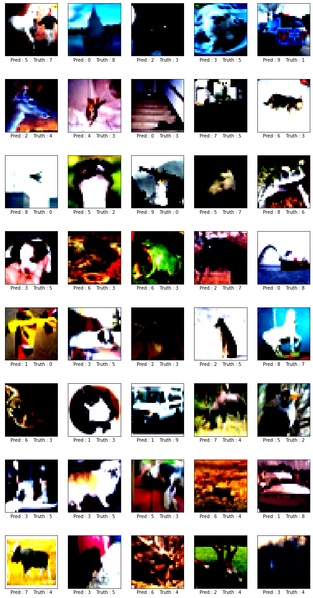
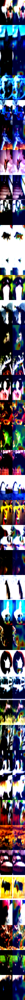

# Session8
## Contents
[Folder Structure](#folder_structure)  
[Training logs](#training_logs)  
[Misclassified Images](#misclassfied_images)  
[GradCam for Misclassified Images](#gradcam_misclassfied_images)  
[Image Augmentations](#image_augmentations)  
[Layer Normalization](#layer_normalization)  


**Folder Structure:**<a name="folder_structure"></a>  
[p81](../p81)
```python
📁 p81/
├─📁 logs/
│ ├─📄 logger.py
│ └─📄 __init__.py
├─📄 main.py
├─📁 utils/
│ ├─📄 get_misclassified_images.py
│ └─📄 transformations.py
├─📄 __init__.py
├─📁 models/
│ ├─📄 __init__.py
│ └─📄 resnet.py
├─📁 data/
│ ├─📄 mnist.py
│ ├─📄 cifar10.py
│ ├─📄 __init__.py
│ └─📁 __pycache__/
│   ├─📄 __init__.cpython-37.pyc
│   └─📄 cifar10.cpython-37.pyc
└─📁 training/
  ├─📄 testing.py
  ├─📄 training.py
  └─📄 __init__.py

```

**Training Logs:**<a name="training_logs"></a>  
```python
Train Epoch 1: 100%
782/782 [02:04<00:00, 6.30batch/s, accuracy=25.0000, loss=2.19]

Test Epoch 1: 100%
157/157 [01:41<00:00, 1.55batch/s, accuracy=12.5000, loss=2.16]

Train_epoch :  15.578000247478485
Test_epoch :  18.940000236034393
Learning Rate :  0.1
Train Epoch 2: 100%
782/782 [01:38<00:00, 7.92batch/s, accuracy=25.0000, loss=2.02]

Test Epoch 2: 100%
157/157 [01:15<00:00, 2.07batch/s, accuracy=25.0000, loss=1.99]

Train_epoch :  23.189999163150787
Test_epoch :  30.539998412132263
Learning Rate :  0.1
Train Epoch 3: 100%
782/782 [01:13<00:00, 10.62batch/s, accuracy=50.0000, loss=1.6]

Test Epoch 3: 100%
157/157 [00:50<00:00, 3.09batch/s, accuracy=50.0000, loss=1.8]

Train_epoch :  30.507999658584595
Test_epoch :  34.86999869346619
Learning Rate :  0.1
Train Epoch 4: 100%
782/782 [00:48<00:00, 16.15batch/s, accuracy=43.7500, loss=1.85]

Test Epoch 4: 100%
157/157 [00:25<00:00, 6.15batch/s, accuracy=12.5000, loss=1.73]

Train_epoch :  34.86599922180176
Test_epoch :  38.499999046325684
Learning Rate :  0.1
Train Epoch 5: 100%
782/782 [00:23<00:00, 33.73batch/s, accuracy=43.7500, loss=1.44]

Test Epoch 5: 100%
157/157 [14:30<00:00, 5.54s/batch, accuracy=56.2500, loss=1.3]

Train_epoch :  37.79999911785126
Test_epoch :  40.16999900341034
Learning Rate :  0.1
Train Epoch 6: 100%
782/782 [02:29<00:00, 5.23batch/s, accuracy=31.2500, loss=1.53]

Test Epoch 6: 100%
157/157 [02:06<00:00, 1.24batch/s, accuracy=62.5000, loss=1.31]

Train_epoch :  40.65199792385101
Test_epoch :  42.78999865055084
Learning Rate :  0.1
Train Epoch 7: 100%
782/782 [02:04<00:00, 6.30batch/s, accuracy=50.0000, loss=1.29]

Test Epoch 7: 100%
157/157 [01:41<00:00, 1.55batch/s, accuracy=68.7500, loss=1.05]

Train_epoch :  42.239999771118164
Test_epoch :  46.619999408721924
Learning Rate :  0.1
Train Epoch 8: 100%
782/782 [01:38<00:00, 7.90batch/s, accuracy=31.2500, loss=1.66]

Test Epoch 8: 100%
157/157 [01:16<00:00, 2.06batch/s, accuracy=43.7500, loss=1.57]

Train_epoch :  44.73799765110016
Test_epoch :  47.96999990940094
Learning Rate :  0.1
Train Epoch 9: 100%
782/782 [01:13<00:00, 10.58batch/s, accuracy=62.5000, loss=1.06]

Test Epoch 9: 100%
157/157 [00:50<00:00, 3.08batch/s, accuracy=37.5000, loss=1.64]

Train_epoch :  46.897998452186584
Test_epoch :  49.789997935295105
Learning Rate :  0.1
Train Epoch 10: 100%
782/782 [00:48<00:00, 16.10batch/s, accuracy=43.7500, loss=1.23]

Test Epoch 10: 100%
157/157 [00:25<00:00, 6.11batch/s, accuracy=37.5000, loss=1.35]

Train_epoch :  49.633997678756714
Test_epoch :  54.50999736785889
Learning Rate :  0.1
Train Epoch 11: 100%
782/782 [00:23<00:00, 33.50batch/s, accuracy=31.2500, loss=1.37]

Test Epoch 11: 100%
157/157 [11:58<00:00, 4.58s/batch, accuracy=62.5000, loss=0.895]

Train_epoch :  51.79199576377869
Test_epoch :  57.87999629974365
Learning Rate :  0.1
Train Epoch 12: 100%
782/782 [02:30<00:00, 5.19batch/s, accuracy=50.0000, loss=1.44]

Test Epoch 12: 100%
157/157 [02:07<00:00, 1.23batch/s, accuracy=50.0000, loss=1.23]

Train_epoch :  54.3720006942749
Test_epoch :  59.939998388290405
Learning Rate :  0.1
Train Epoch 13: 100%
782/782 [02:05<00:00, 6.25batch/s, accuracy=68.7500, loss=0.855]

Test Epoch 13: 100%
157/157 [01:42<00:00, 1.54batch/s, accuracy=62.5000, loss=0.936]

Train_epoch :  57.01599717140198
Test_epoch :  60.04999876022339
Learning Rate :  0.1
Train Epoch 14: 100%
782/782 [01:39<00:00, 7.84batch/s, accuracy=43.7500, loss=1.42]

Test Epoch 14: 100%
157/157 [01:16<00:00, 2.05batch/s, accuracy=50.0000, loss=1.17]

Train_epoch :  59.65399742126465
Test_epoch :  59.3999981880188
Learning Rate :  0.1
Train Epoch 15: 100%
782/782 [01:14<00:00, 10.52batch/s, accuracy=68.7500, loss=0.837]

Test Epoch 15: 100%
157/157 [00:51<00:00, 3.06batch/s, accuracy=75.0000, loss=1.01]

Train_epoch :  60.99199652671814
Test_epoch :  60.53000092506409
Learning Rate :  0.1
Train Epoch 16: 100%
782/782 [00:48<00:00, 15.98batch/s, accuracy=68.7500, loss=0.872]

Test Epoch 16: 100%
157/157 [00:25<00:00, 6.07batch/s, accuracy=81.2500, loss=0.839]

Train_epoch :  63.00399899482727
Test_epoch :  66.24999642372131
Learning Rate :  0.1
Train Epoch 17: 100%
782/782 [00:23<00:00, 33.27batch/s, accuracy=50.0000, loss=1.22]

Test Epoch 17: 100%
157/157 [09:26<00:00, 3.61s/batch, accuracy=43.7500, loss=1.38]

Train_epoch :  64.73199725151062
Test_epoch :  67.84999966621399
Learning Rate :  0.1
Train Epoch 18: 100%
782/782 [02:31<00:00, 5.17batch/s, accuracy=62.5000, loss=1.15]

Test Epoch 18: 100%
157/157 [02:08<00:00, 1.22batch/s, accuracy=81.2500, loss=0.731]

Train_epoch :  66.32199883460999
Test_epoch :  69.760000705719
Learning Rate :  0.1
Train Epoch 19: 100%
782/782 [02:05<00:00, 6.21batch/s, accuracy=75.0000, loss=0.591]

Test Epoch 19: 100%
157/157 [01:42<00:00, 1.53batch/s, accuracy=68.7500, loss=0.615]

Train_epoch :  67.39999651908875
Test_epoch :  70.74999809265137
Learning Rate :  0.1
Train Epoch 20: 100%
782/782 [01:40<00:00, 7.78batch/s, accuracy=50.0000, loss=1.33]

Test Epoch 20: 100%
157/157 [01:17<00:00, 2.03batch/s, accuracy=75.0000, loss=0.613]

Train_epoch :  68.81799697875977
Test_epoch :  70.62999606132507
Learning Rate :  0.1
Train Epoch 21: 100%
782/782 [01:14<00:00, 10.43batch/s, accuracy=75.0000, loss=0.828]

Test Epoch 21: 100%
157/157 [00:51<00:00, 3.04batch/s, accuracy=81.2500, loss=0.368]

Train_epoch :  70.44999599456787
Test_epoch :  74.4599997997284
Learning Rate :  0.1
Train Epoch 22: 100%
782/782 [00:49<00:00, 15.87batch/s, accuracy=81.2500, loss=0.507]

Test Epoch 22: 100%
157/157 [00:25<00:00, 6.04batch/s, accuracy=62.5000, loss=0.906]

Train_epoch :  71.24599814414978
Test_epoch :  74.04999732971191
Learning Rate :  0.1
Train Epoch 23: 100%
782/782 [00:23<00:00, 33.14batch/s, accuracy=75.0000, loss=0.558]

Test Epoch 23: 100%
157/157 [06:52<00:00, 2.63s/batch, accuracy=62.5000, loss=0.64]

Train_epoch :  72.48199582099915
Test_epoch :  72.63000011444092
Learning Rate :  0.1
Train Epoch 24: 100%
782/782 [02:30<00:00, 5.18batch/s, accuracy=62.5000, loss=1.02]

Test Epoch 24: 100%
157/157 [02:07<00:00, 1.23batch/s, accuracy=75.0000, loss=0.754]

Train_epoch :  73.64000082015991
Test_epoch :  76.81999802589417
Learning Rate :  0.1
Train Epoch 25: 100%
782/782 [02:05<00:00, 6.24batch/s, accuracy=75.0000, loss=0.663]

Test Epoch 25: 100%
157/157 [01:42<00:00, 1.54batch/s, accuracy=75.0000, loss=0.74]

Train_epoch :  74.6999979019165
Test_epoch :  76.40999555587769
Learning Rate :  0.1
Train Epoch 26: 100%
782/782 [01:39<00:00, 7.84batch/s, accuracy=68.7500, loss=0.929]

Test Epoch 26: 100%
157/157 [01:16<00:00, 2.05batch/s, accuracy=68.7500, loss=0.859]

Train_epoch :  75.72599649429321
Test_epoch :  77.37999558448792
Learning Rate :  0.1
Train Epoch 27: 100%
782/782 [01:14<00:00, 10.53batch/s, accuracy=93.7500, loss=0.276]

Test Epoch 27: 100%
157/157 [00:51<00:00, 3.07batch/s, accuracy=62.5000, loss=1.04]

Train_epoch :  76.40599608421326
Test_epoch :  76.57999992370605
Learning Rate :  0.1
Train Epoch 28: 100%
782/782 [00:48<00:00, 16.05batch/s, accuracy=75.0000, loss=0.739]

Test Epoch 28: 100%
157/157 [00:25<00:00, 6.13batch/s, accuracy=87.5000, loss=0.447]

Train_epoch :  77.3319959640503
Test_epoch :  78.49999666213989
Learning Rate :  0.1
Train Epoch 29: 100%
782/782 [00:23<00:00, 33.60batch/s, accuracy=87.5000, loss=0.478]

Test Epoch 29: 100%
157/157 [04:19<00:00, 1.65s/batch, accuracy=68.7500, loss=0.752]

Train_epoch :  78.19799780845642
Test_epoch :  79.01999950408936
Learning Rate :  0.1
Train Epoch 30: 100%
782/782 [02:31<00:00, 5.18batch/s, accuracy=62.5000, loss=1.29]

Test Epoch 30: 100%
157/157 [02:08<00:00, 1.22batch/s, accuracy=81.2500, loss=0.682]

Train_epoch :  78.92599701881409
Test_epoch :  77.4399995803833
Learning Rate :  0.1
Train Epoch 31: 100%
782/782 [02:05<00:00, 6.22batch/s, accuracy=93.7500, loss=0.349]

Test Epoch 31: 100%
157/157 [01:42<00:00, 1.53batch/s, accuracy=93.7500, loss=0.274]

Train_epoch :  79.87200021743774
Test_epoch :  74.61000084877014
Learning Rate :  0.1
Train Epoch 32: 100%
782/782 [01:40<00:00, 7.80batch/s, accuracy=87.5000, loss=0.488]

Test Epoch 32: 100%
157/157 [01:17<00:00, 2.04batch/s, accuracy=87.5000, loss=0.657]

Train_epoch :  80.38600087165833
Test_epoch :  78.78999710083008
Learning Rate :  0.1
Train Epoch 33: 100%
782/782 [01:14<00:00, 10.48batch/s, accuracy=56.2500, loss=0.865]

Test Epoch 33: 100%
157/157 [00:51<00:00, 3.05batch/s, accuracy=62.5000, loss=1.53]

Train_epoch :  80.92399835586548
Test_epoch :  78.81999611854553
Learning Rate :  0.1
Train Epoch 34: 100%
782/782 [00:49<00:00, 15.92batch/s, accuracy=93.7500, loss=0.211]

Test Epoch 34: 100%
157/157 [00:25<00:00, 6.05batch/s, accuracy=87.5000, loss=0.447]

Train_epoch :  81.50799870491028
Test_epoch :  80.42999505996704
Learning Rate :  0.1
Train Epoch 35: 100%
782/782 [00:23<00:00, 33.24batch/s, accuracy=93.7500, loss=0.292]

Test Epoch 35: 100%
157/157 [01:46<00:00, 1.47batch/s, accuracy=81.2500, loss=0.611]

Train_epoch :  82.01599717140198
Test_epoch :  80.15999794006348
Learning Rate :  0.1
Train Epoch 36: 100%
782/782 [01:43<00:00, 7.58batch/s, accuracy=93.7500, loss=0.359]

Test Epoch 36: 100%
157/157 [01:19<00:00, 1.96batch/s, accuracy=87.5000, loss=0.617]

Train_epoch :  83.02599787712097
Test_epoch :  81.1299979686737
Learning Rate :  0.1
Train Epoch 37: 100%
782/782 [01:17<00:00, 10.09batch/s, accuracy=87.5000, loss=0.241]

Test Epoch 37: 100%
157/157 [00:54<00:00, 2.90batch/s, accuracy=87.5000, loss=0.324]

Train_epoch :  83.70199799537659
Test_epoch :  81.62999749183655
Learning Rate :  0.1
Train Epoch 38: 100%
782/782 [00:51<00:00, 15.10batch/s, accuracy=93.7500, loss=0.452]

Test Epoch 38: 100%
157/157 [00:28<00:00, 5.50batch/s, accuracy=93.7500, loss=0.515]

Train_epoch :  84.1219961643219
Test_epoch :  81.58999681472778
Learning Rate :  0.1
Train Epoch 39: 100%
782/782 [00:26<00:00, 29.90batch/s, accuracy=81.2500, loss=0.457]

Test Epoch 39: 100%
157/157 [00:02<00:00, 53.32batch/s, accuracy=68.7500, loss=0.706]

Train_epoch :  84.92599725723267
Test_epoch :  81.8399965763092
Learning Rate :  0.1
```

**Misclassified Images:**<a name="misclassfied_images"></a>  
 


**GradCam for Misclassified Images:**<a name="gradcam_misclassfied_images"></a>  
&nbsp;&nbsp;Original&nbsp;&nbsp;&nbsp;&nbsp;&nbsp;&nbsp;&nbsp;&nbsp;&nbsp;&nbsp;&nbsp;Gradcam



**Image Augmentations:**<a name="image_augmentations"></a>  
```python
def train_transform_list(mean,std_dev):
    return A.Compose(
        [
            A.Normalize(mean=mean, std=std_dev),
            A.Rotate(limit = (-5,5),always_apply = True),
#            A.ShiftScaleRotate(shift_limit=0.0625, scale_limit=0.50, rotate_limit=(-7,7), p=.75),
#            A.CoarseDropout (max_holes = 1, max_height=16, max_width=16, min_holes = 1, min_height=16, min_width=16, fill_value=mean,p = 0.75),
            A.Cutout(num_holes=1, max_h_size=16, max_w_size=16, fill_value=[1,1,1], always_apply=True, p=0.5),
#            A.HorizontalFlip(p=0.75),
            A.RandomCrop(32,32),
            ToTensorV2()
        ]
    )

def test_transform_list(mean,std_dev):
    return A.Compose(
        [
            A.Normalize(mean=mean, std=std_dev),
            ToTensorV2()
        ]
    )

```

**Layer Normalization:**<a name="layer_normalization"></a>  
Layer normalization is a special case of Group normalization where Group is 1.
```python
class BasicBlock(nn.Module):
    expansion = 1

    def __init__(self, in_planes, planes, stride=1):
        super(BasicBlock, self).__init__()
        self.conv1 = nn.Conv2d(
            in_planes, planes, kernel_size=3, stride=stride, padding=1, bias=False)
        self.bn1 = nn.GroupNorm(1,planes)
        self.conv2 = nn.Conv2d(planes, planes, kernel_size=3,
                               stride=1, padding=1, bias=False)
        self.bn2 = nn.GroupNorm(1,planes)

        self.shortcut = nn.Sequential()
        if stride != 1 or in_planes != self.expansion*planes:
            self.shortcut = nn.Sequential(
                nn.Conv2d(in_planes, self.expansion*planes,
                          kernel_size=1, stride=stride, bias=False),
                nn.GroupNorm(1,self.expansion*planes)
            )

    def forward(self, x):
        out = F.relu(self.bn1(self.conv1(x)))
        out = self.bn2(self.conv2(out))
        out += self.shortcut(x)
        out = F.relu(out)
        return out


class ResNet(nn.Module):
    def __init__(self, block, num_blocks, num_classes=10):
        super(ResNet, self).__init__()
        self.in_planes = 64

        self.conv1 = nn.Conv2d(3, 64, kernel_size=3,
                               stride=1, padding=1, bias=False)
        self.bn1 = nn.GroupNorm(1,64)
        self.layer1 = self._make_layer(block, 64, num_blocks[0], stride=1)
        self.layer2 = self._make_layer(block, 128, num_blocks[1], stride=2)
        self.layer3 = self._make_layer(block, 256, num_blocks[2], stride=2)
        self.layer4 = self._make_layer(block, 512, num_blocks[3], stride=2)
        self.linear = nn.Linear(512*block.expansion, num_classes)

    def _make_layer(self, block, planes, num_blocks, stride):
        strides = [stride] + [1]*(num_blocks-1)
        layers = []
        for stride in strides:
            layers.append(block(self.in_planes, planes, stride))
            self.in_planes = planes * block.expansion
        return nn.Sequential(*layers)

    def forward(self, x):
        out = F.relu(self.bn1(self.conv1(x)))
        out = self.layer1(out)
        out = self.layer2(out)
        out = self.layer3(out)
        out = self.layer4(out)
        out = F.avg_pool2d(out, 4)
        out = out.view(out.size(0), -1)
        out = self.linear(out)
        return out


def ResNet18():
    return ResNet(BasicBlock, [2, 2, 2, 2])
```


References  
https://github.com/earnestt1234/seedir  


